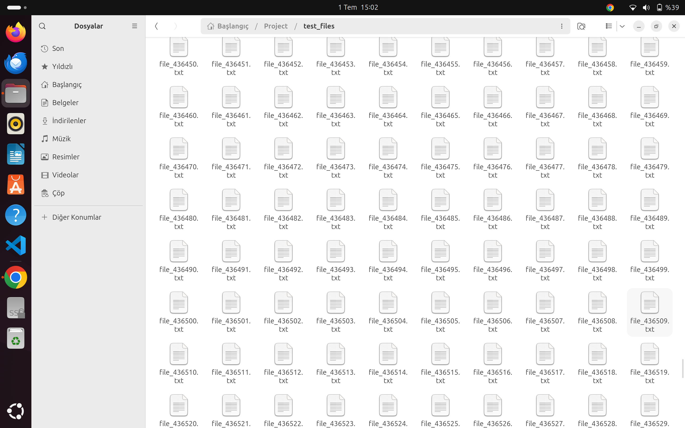

# Parallel File Hashing (C++)

This project demonstrates file hashing in C++ across 4 versions, improving performance through multithreading and pipelining.

## Test File Image(+500.000 Files)


## Versions
- V1: Basic single-threaded
- V2: Multi-threaded version
- V3: Memory-optimized
- V4: 3-stage pipeline (fastest)

## Build Example (V4)

```bash
cd v4_pipeline
g++ -std=c++17 main.cpp -o hasher -pthread
./hasher ../test_files > ../Outputs/output_v4.txt
```
## Test Files

To generate your own test data,use the script below:
```
#!/bin/bash
mkdir -p test_files
for i in {1..500000}; do
    echo "This is file number $i" > test_files/file_$i.txt
done

